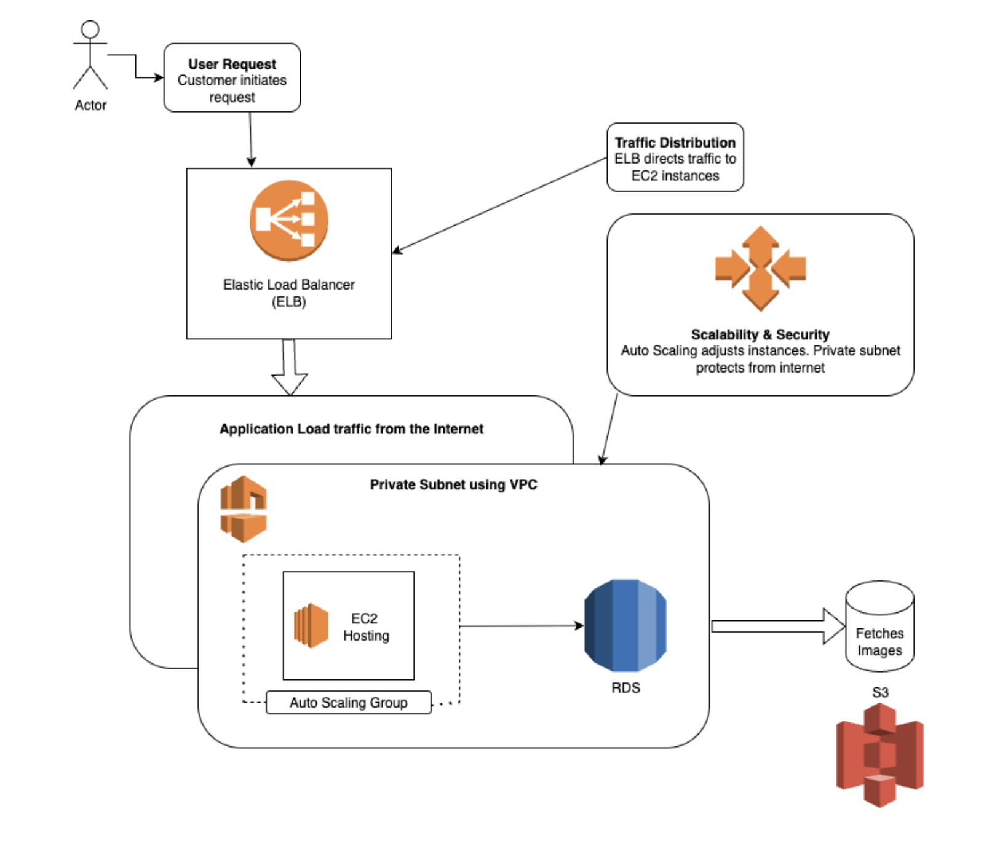

# Full-Stack E-Commerce Web Application

This repository contains a full-stack e-commerce web application featuring a modern React frontend and a robust Node.js/Express backend integrated with a MySQL database.

---

## 🏗️ Architecture & Features

The project is structured into two main components:
*   **Backend (`/backend`)**:
    *   Powered by **Node.js** and **Express**.
    *   Connected to a **MySQL** database using the `mysql2` client library (configured with connection pooling and promise-based syntax).
    *   Exposes a REST API endpoint `GET /api/products` to retrieve list of products.
    *   Serves compiled production-ready frontend assets statically.
*   **Frontend (`/frontend`)**:
    *   Built with **React**, bootstrapped using **Vite** for blazing fast Hot Module Replacement (HMR).
    *   Implements an interactive **Product Grid** with dynamic placeholder images.
    *   Includes a fully responsive **Shopping Cart** panel allowing users to add items, modify quantities (with live total calculation), and remove items.
    *   Uses a curated pastel-themed CSS design layout with sleek visual states and smooth interactions.

---

## 🌐 Cloud Architecture

Below is the cloud deployment architecture diagram for the e-commerce application on AWS:



### AWS Services & Architecture Explanation

*   **User / Actor**: Customers access the application via their web browsers, initiating requests over the internet.
*   **Elastic Load Balancer (ELB)**: Serves as the single point of entry. It distributes incoming traffic across the running EC2 instances inside the Target Group, ensuring high availability and fault tolerance.
*   **Virtual Private Cloud (VPC)**: Houses all cloud resources, isolating the environment and providing network segmentation to secure compute and database instances.
*   **Auto Scaling Group (ASG)**: Manages and scales the application tier instances automatically depending on load, maintaining performance and minimizing cost.
*   **EC2 Instances**: Host the full-stack web application, running the Node.js/Express backend which serves the compiled React frontend assets.
*   **Amazon RDS (MySQL)**: A managed database instance situated in the database tier, storing dynamic product, user, and transaction data.
*   **Amazon S3**: Hosts static media assets (such as product images), offloading static asset delivery from the EC2 application servers.

---

### ⚙️ Detailed AWS Deployment & Services Configuration

This project was deployed on AWS using a highly secure, scalable, and resilient cloud architecture. Below are the specific configuration details:

#### 1. 🔒 Network & Security Groups Setup
A custom **Virtual Private Cloud (VPC)** was created to isolate all resources. To enforce strict security boundaries, three distinct security groups were configured:

| Security Group | Description | Allowed Inbound Traffic | Purpose |
| :--- | :--- | :--- | :--- |
| **`elb-sg`** | Load Balancer SG | HTTP (80) & HTTPS (443) from `0.0.0.0/0` (public internet) | Allows public web traffic to reach the Load Balancer. |
| **`app-sg`** | Application Server SG | Ports needed for Node/React backend **only** from the load balancer (`elb-sg`) | Protects application instances from direct public internet access. |
| **`db-sg`** | Database Server SG | MySQL Port (3306) **only** from the application servers (`app-sg`) | Limits database access strictly to the application tier. |

#### 2. 🗄️ Database & Storage Layer Configuration
*   **Amazon RDS (MySQL Instance)**: Created with **no public access** enabled. It is deployed within the VPC and secured by `db-sg`, ensuring it is only accessible from the EC2 instances running the backend application.
*   **Amazon S3 (Simple Storage Service)**: Created an S3 bucket with public access specifically for storing and serving static application assets (like product images).

#### 3. 🚀 Compute, IAM & Auto-Scaling Configuration
*   **IAM Security Role (`EC2-S3-Access-Role`)**: Created a custom Identity and Access Management (IAM) role that grants EC2 instances full read/write access to the S3 bucket.
*   **Launch Template**: Configured to automate the provisioning of identical, pre-configured application servers. It specifies:
    *   The `app-sg` security group for network isolation.
    *   The `EC2-S3-Access-Role` IAM profile for S3 authorization.
    *   **User Data Script**: A startup shell script that automatically executes on instance boot to:
        1. Install system dependencies (Node.js, npm, git, etc.).
        2. Clone the application repository from GitHub.
        3. Set up local configurations and environment variables (connecting backend to RDS endpoint/credentials and S3 bucket).
        4. Install packages and start the server application.
*   **Target Group & Elastic Load Balancer (ELB)**: Created a target group containing the dynamically provisioned EC2 instances, and configured the Classic/Application Load Balancer to route traffic to them.
*   **Auto Scaling Group (ASG)**:
    *   Attached to the existing Elastic Load Balancer and target group.
    *   **Capacity Settings**: Desired capacity = **2**, Minimum capacity = **1**, Maximum capacity = **4**.
    *   **Resiliency & High Availability Test**: Successfully verified the auto-scaling capability by manually terminating running EC2 instances. The Auto Scaling Group automatically detected the unhealthy state and launched new EC2 instances to restore the running count back to the desired capacity of **2**.

---

## 🛠️ Tech Stack

*   **Frontend**: React (v19), CSS (custom pastel theme), Vite
*   **Backend**: Node.js, Express (v5)
*   **Database**: MySQL
*   **Libraries & Tooling**: `nodemon` (auto-reloading dev server), `dotenv` (environment configuration), `cors` (Cross-Origin Resource Sharing)

---

## 🚀 AWS Deployment Guide (Getting Started)

To deploy and run this full-stack application on the AWS infrastructure configured in this project, follow the guide below:

### 📋 Prerequisites
*   An active **AWS Account** with permissions to configure VPC, EC2, RDS, S3, IAM, and ELB/ASG.
*   **GitHub Repository** hosting this project codebase.
*   **MySQL Client** (installed locally or on a bastion host) to initialize the RDS database.

---

### 🗄️ 1. RDS Database Provisioning & Schema Setup
1.  **Launch RDS MySQL**: Ensure you have an Amazon RDS instance running MySQL in your VPC, configured under the `db-sg` security group (no public access).
2.  **Connect to RDS**: Use an EC2 instance within the same VPC (acting as a bastion host) or a secure VPN connection to log into the database:
    ```bash
    mysql -h <rds-endpoint-hostname> -P 3306 -u <your_rds_master_username> -p
    ```
3.  **Create Database**: Run the following commands to initialize the schema:
    ```sql
    CREATE DATABASE ecommerce_db;
    USE ecommerce_db;
    ```
4.  **Create Products Table**:
    ```sql
    CREATE TABLE products (
        id INT AUTO_INCREMENT PRIMARY KEY,
        name VARCHAR(255) NOT NULL,
        description TEXT,
        price DECIMAL(10, 2) NOT NULL
    );
    ```
5.  **Insert Sample Products**:
    ```sql
    INSERT INTO products (name, description, price) VALUES
    ('Minimalist Mechanical Keyboard', 'A compact tenkeyless mechanical keyboard with RGB backlighting and tactile switches.', 89.99),
    ('Ergonomic Wireless Mouse', 'High-precision wireless mouse designed for comfort and extended productivity.', 49.99),
    ('Active Noise Cancelling Headphones', 'Over-ear wireless headphones with premium sound quality and active ambient noise cancellation.', 199.99),
    ('Smart Fitness Watch', 'Waterproof fitness tracker with heart rate monitor, sleep tracking, and 10-day battery life.', 129.50),
    ('Ultra-Wide Curved Monitor', '34-inch curved gaming and productivity monitor with 144Hz refresh rate.', 349.99);
    ```

---

### ⚙️ 2. Launch Template & EC2 User Data Configuration
To bootstrap the application servers automatically when launched by the Auto Scaling Group, configure the **User Data Script** in your EC2 Launch Template. 

Create a startup script that does the following:
```bash
#!/bin/bash
# 1. Update and install dependencies
sudo apt-get update -y
sudo apt-get install -y nodejs npm git

# 2. Clone the repository
git clone https://github.com/HypnoticShield/aws-ecommerce-project.git /home/ubuntu/app
cd /home/ubuntu/app

# 3. Create the backend production configuration (.env)
cat <<EOF > backend/.env
PORT=8080
DB_HOST=<rds-endpoint-hostname>
DB_USER=<your_rds_master_username>
DB_PASSWORD=<your_rds_password>
DB_NAME=ecommerce_db
EOF

# 4. Build and Compile Frontend assets
cd frontend
npm install
npm run build # Generates the production bundle directly in backend/dist

# 5. Launch Node.js/Express Backend Server
cd ../backend
npm install
npm install -g pm2
pm2 start index.js --name "ecommerce-api" --update-env
```

---

### 💻 3. Routing & Load Balancer Verification
Once the EC2 instances are provisioned by the Auto Scaling Group:
1. The **Elastic Load Balancer (ELB)** routes public web traffic (`http://<elb-dns-name>/`) directly to the target group containing your EC2 instances on port `8080`.
2. The Node.js Express server automatically serves the compiled Vite production assets from the static `dist/` directory:
   ```javascript
   app.use(express.static(path.join(__dirname, 'dist')));
   ```
3. Any fallback web routes are routed to the React Single Page Application (SPA):
   ```javascript
   app.get('*', (req, res) => {
       res.sendFile(path.join(__dirname, 'dist', 'index.html'));
   });
   ```
4. Access the fully deployed e-commerce application in your web browser using your load balancer's DNS name:
   `http://<your-load-balancer-dns-name>`
